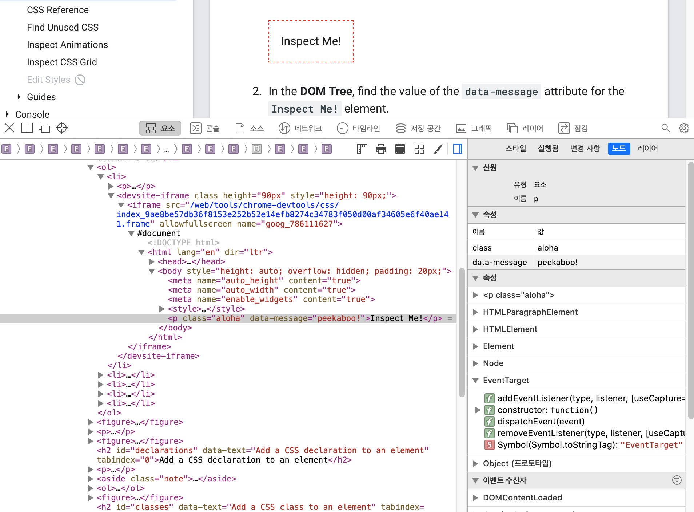
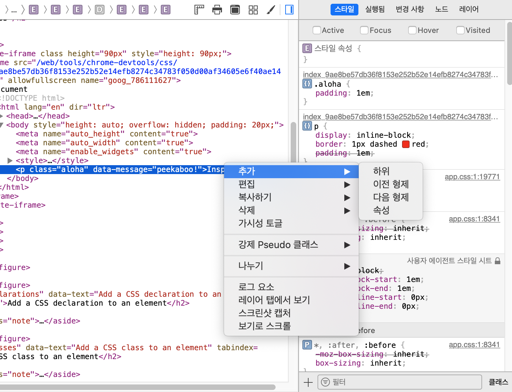
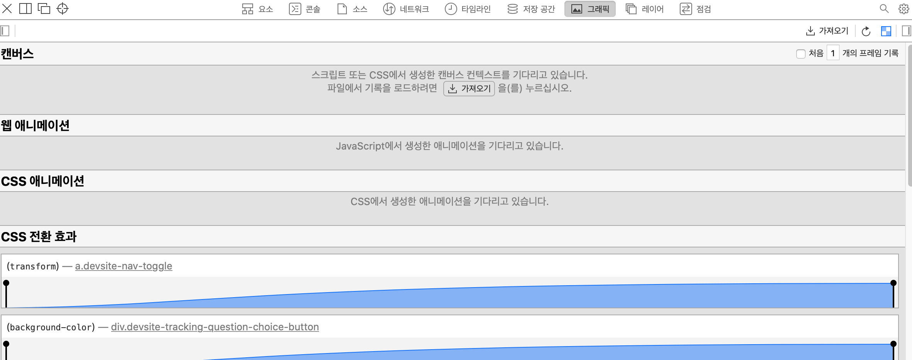
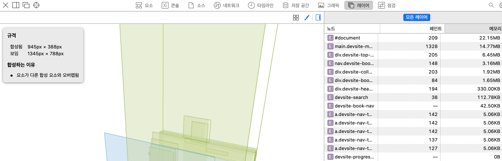
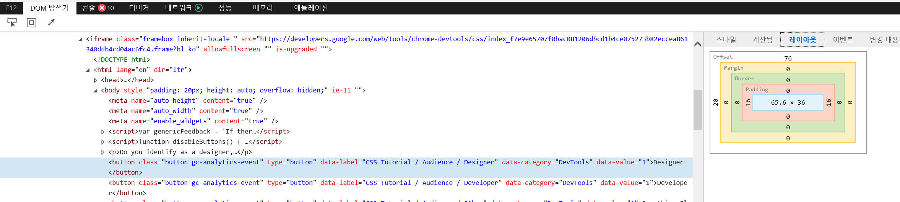
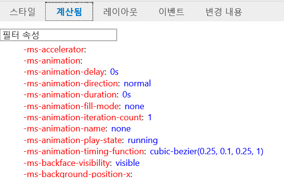
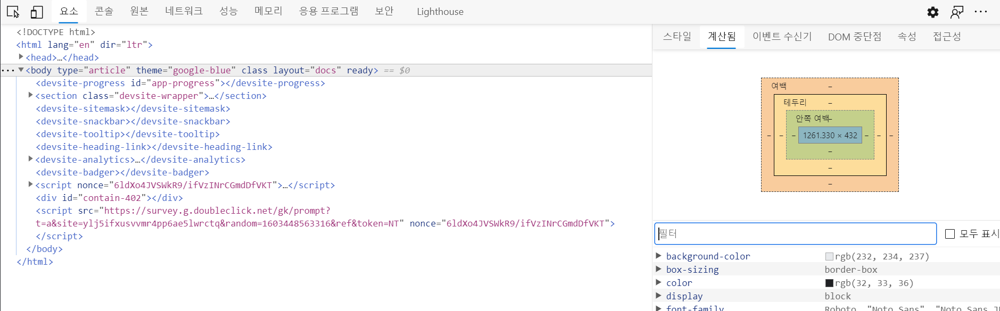

# 요소 검사

### chrome

### firefox

- 그리드와 플렉스 박스를 보여주는 view가 존재

- 글꼴을 확인하고 폰트나 line-height 등의 font css 속성을 GUI로 조절할 수 있다.
- 폰트 css 속성을 수정하는게 그렇게 번거로운 일은 아니라서 별로 유용해보이지는 않음.. 

- inline으로 수정한 내역을 보여준다. 

- state에 따라 변경되는 css 를 보여준다. 
- 별로 안 유용해 보임

### Safari

- 노드 탭에서 속성을 쉽게 볼 수 있다.
- 요소간에 단축키는 크롬과 동일하다.

- 요소 사이에 하위/이전형제/다음형제/속성을 선택해서 추가할 수 있다.
- 스타일 탭의 클래스/필터 등의 기능은 크롬과 동일하다.

- 캔버스, 애니메이션 등을 확인할 수 있는 탭
  

- 현재 선택한 요소가 전체 문서 구조에 어떻게 포함되어있는지를 3d로 보여준다.
- (굳이 왜 필요한지 모를..)
- 요소별 상세 정보를 오른쪽에서 확인할 수 있다.

### IE 11
- 느리다
- hover 와 visited state만 제공된다. 
- [레이아웃]과 [계산됨] 이라는 탭으로 분리가 되어있어서 불편하다. 
- 전체적으로 가독성이 안좋다.
- 요소 디버깅이 안된다.

### MicroSoft Edge
- 크롬 렌더링 엔진을 사용하기 때문에 개발자도구도 거의 동일하다.
  
