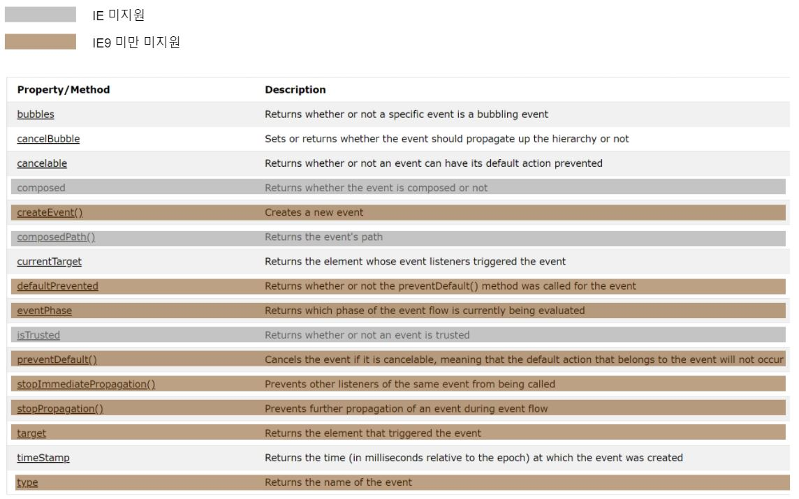

# 13장 이벤트

## DOM (Document Object Model)
동적으로 문서의 내용, 구조, 스타일에 접근하고 변경하는 수단
> DOM Level
> 
> Level 0 : js에서 접근할 수 있는 dom이 제한적 
> 
> Level 1 : 

## 1. 이벤트 흐름
이벤트가 전달되는 순서

### 1.1 이벤트 버블링
이벤트가 처음 발생하는 요소에서 document 또는 window 객체까지 각 노드마다 이벤트 발생

`div` -> `body` -> `html` -> `document`
```javascript 
<!DOCTYPE html>
<html>
    <head>
        <title>Event Bubbling Example</title>
    </head>
    <body>
        <div id="myDiv">Click Me</div>
    </body>
</html>
```

### 1.2 이벤트 캡처링
최상위 노드에서 이벤트가 처음 발생하는 요소까지 이벤트 발생

`div` -> `body` -> `html` -> `document`
```javascript 
<!DOCTYPE html>
<html>
    <head>
        <title>Event Bubbling Example</title>
    </head>
    <body>
        <div id="myDiv">Click Me</div>
    </body>
</html>
```

### 1.3 이벤트 흐름
- 캡처링 -> 타겟 -> 버블링


> [예제 코드](https://jsfiddle.net/leewonhee/bu17ozkw/3/)

## 2. 이벤트 핸들러
> 이벤트 : 사용자 또는 브라우저가 취하는 특정 동작
> 
> 이벤트 핸들러(리스너) : 이벤트에 응답하여 호출되는 함수

### 2.1 HTML 이벤트 핸들러
이벤트 핸들러 이름 또는 이벤트 핸들러로써 실행할 자바스크립트 코드를 HTML 속성에 할당한다.

```html
<script type="text/javascript"> 
    function onclickHandler(t){
        console.log('this : ', this);
        console.log('t : ', t);
        console.log('document : ', document);
    }
</script>
<input type="button" value="1번" onclick="onclickHandler()"/> 
<input type="button" value="2번" onclick="onclickHandler(this)"/> 
<input type="button" value="3번" onclick="console.log(this)"/>
```
<br>

이벤트 핸들러 함수는 with를 통해 확장된 스코프 체인을 통해 this, document 객체에 접근할 수 있다.
``` javascript
function (){
    with(document){
        with(this){

        }
    }
}
```
> with문은 with 다음에 오는 블럭의 스코프 체인에 객체를 추가해준다.


### 2.2 DOM 레벨 0 이벤트 핸들러
이벤트 핸들러 프로퍼티에 함수를 할당하는 방법

```html
<input id="myBtn" type="button" value="클릭"/> 
<script type="text/javascript"> 
    var btn = document.getElementById('myBtn');
    btn.onclick = function(){
        console.log('this.id : ', this.id);
    };
</script>
```
이 이벤트 핸들러는 해당 요소의 메서드로 간주되어, 이벤트 핸들러 내에서의 this는 요소 자체이다.

<br>

```html
<html>
    <head>
        <title>Event Bubbling Example</title>
    </head>
    <style>
        body * {
            margin: 10px;
            border: 1px solid blue;
        }
    </style>
    <body id="myBody">
        <form id="myForm">FORM
          <div id="myDiv">DIV
            <p id="myP">P</p>
          </div>
        </form>
    </body>
</html>
<script>
    var myBody = document.getElementById('myBody');
    var myForm = document.getElementById('myForm');
    var myDiv = document.getElementById('myDiv');
    var myP = document.getElementById('myP');
    myBody.onclick = function (){
        console.log('myBody');
    };
    myForm.onclick = function (){
        console.log('myForm');
    };
    myDiv.onclick = function (){
        console.log('myDiv');
    };
    myP.onclick = function (){
        console.log('myP');
    };
</script>
```
```javascript
btn.onclick = null; // 이벤트 핸들러 제거
```

### 2.3 DOM 레벨 2 이벤트 핸들러
- addEventListener / removeEventListener
- 매개변수
  - 이벤트 이름
  - 이벤트 핸들러 함수
  - 이벤트 핸들러를 캡처 단계에서 호출할지(true), 버블링 단계에서 호출할지(false)
- this는 이벤트 핸들러가 추가된 요소
> 인터넷 익스플로러 9 이후 버전, 파이어폭스, 사파리, 크롬, 오페라에서 지원
```javascript
var btn = document.getElementById('myBtn');
btn.addEventListener('click', function(){
    console.log('this.id : ', this.id);
}, false);
btn.addEventListener('click', function(){
    console.log('Hello!');
}, false);
btn.removeEventListener('click', function(){
    console.log('Hello!');
}, false); // 제거 안됨!
```

### 2.4 인터넷 익스플로러 이벤트 핸들러
- attachEvent / detachEvent
- 매개변수
  - 이벤트 이름
  - 이벤트 핸들러 함수
- 이벤트 핸들러를 여러개 추가한 경우 추가한 순서의 반대로 동작
- this는 window 전역 객체
```javascript
var btn = document.getElementById('myBtn');
btn.attachEvent('onclick', function(){
    console.log(this === window); // true
})
```

## 3. event 객체
이벤트 정보를 가지고 있는 객체

### 3.1 DOM event 객체

### 3.1.1 프로퍼티/메서드



- this 객체는 항상 currentTarget 값과 일치
- target에는 실제 타겟만 포함

```html
<input id="myBtn" type="button" value="클릭"/> 
<script type="text/javascript"> 
    var btn = document.getElementById('myBtn');
    btn.onclick = function(event){
        console.log(event.currentTarget === this); // true
        console.log(event.target === this); // true
    }
    btn.addEventListener('click', function(event){
        console.log(event.currentTarget === this); // true
        console.log(event.target === this); // true
    })
    document.body.onclick = function (event){
        console.log(event.currentTarget === document.body); // true
        console.log(this === document.body); // true
        console.log(event.target === btn); // true
    }
</script>
```

### 3.1.2 preventDefault()
이벤트의 기본 동작을 취소
- 이벤트의 cancelable 속성이 true 인 경우에만 가능

### 3.1.3 stopPropagation()
이벤트 흐름 중지

```html
<input id="myBtn" type="button" value="클릭"/> 
<script type="text/javascript"> 
    var btn = document.getElementById('myBtn');
    btn.onclick = function(event){
        alert('Clicked!');
        event.stopPropagation();
    }
    document.body.onclick = function (event){
        alert('Body Clicked!');
    }
</script>
```

### stopImmediatePropagation()
이벤트 흐름을 중지시키고, 다른 이벤트 핸들러 호출을 막는다.
```html
<input id="myBtn" type="button" value="클릭"/> 
<script type="text/javascript"> 
    var btn = document.getElementById('myBtn');
    btn.addEventListener('click',function(event){
        alert('Clicked!');
        event.stopImmediatePropagation();
    })
    btn.addEventListener('click',function(event){
        alert('Clicked!2');
    })
</script>
```

### 3.1.4 eventPhase
이벤트 흐름 중 현재 진행 중인 단계를 의미
- 1: 캡처링 / 2: 타깃 / 3: 버블링
```html
<html>
    <head>
        <title>Event Bubbling Example</title>
    </head>
    <body>
        <form>FORM
          <div>DIV
            <p>P</p>
          </div>
        </form>
    </body>
</html>
<script>
  for(let elem of document.querySelectorAll('*')) {
    elem.addEventListener("click", e => console.log(`캡쳐링: ${elem.tagName}, eventPhase: ${e.eventPhase}`), true);
    elem.addEventListener("click", e => console.log(`버블링: ${elem.tagName}, eventPhase: ${e.eventPhase}`));
  }
</script>
```

### 3.2 인터넷 익스플로러의 event 객체
> 인터넷 익스플로러 9 아래 버전 기준

이벤트 핸들러를 어떻게 할당했느냐에 따라 event 객체에 다르게 접근한다.

```html
<input id="myBtn" type="button" value="클릭"/> 
<script type="text/javascript"> 
    var btn = document.getElementById('myBtn');
    btn.onclick = function(){
        var event = window.event;
        console.log(event.type); // click
    }
    btn.attachEvent('onclick', function (event){
        console.log(event.type); // click
        console.log(window.event.type); // click
    })
</script>
```
| 프로퍼티/메서드 | 타입 | 읽기/쓰기 | 설명 |
|----|:----:|:-----:|----|
| cancelBubble | 불리언 | 읽기/쓰기 | 기본적으로 false이지만 true를 지정하여 이벤트 버블링을 취소할 수 있다. DOM 표준의 stopPropagation()메서드와 동일. |
| returnValue | 불리언 | 읽기/쓰기 | 기본적으로 true지만 false를 지정하여 기본 동작을 취소할 수 있다. DOM 표준의 preventDefault() 메서드와 동일. |
| srcElement | 요소 | 읽기 전용 | 이벤트 타깃. DOM 표준의 target 프로퍼티와 같다.  |
| type | 문자열 | 읽기 전용 | 이벤트 타입 |
  

## 참고
- https://developer.mozilla.org/ko/docs/Web/API/Event
- https://ko.javascript.info/bubbling-and-capturing
- https://stackoverflow.com/questions/4616694/what-is-event-bubbling-and-capturing
- https://stackoverflow.com/questions/17665489/using-this-inside-an-event-handler
- https://caniuse.com/
- https://www.w3.org/TR/DOM-Level-3-Events/#event-type-load
